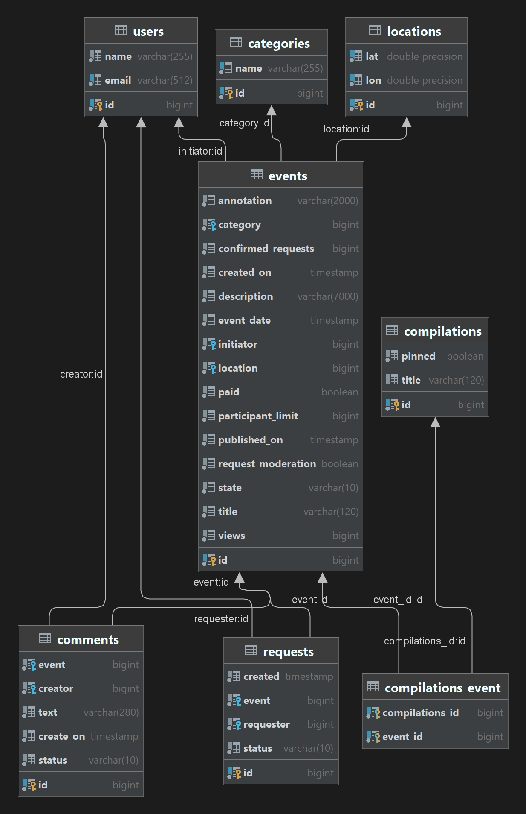
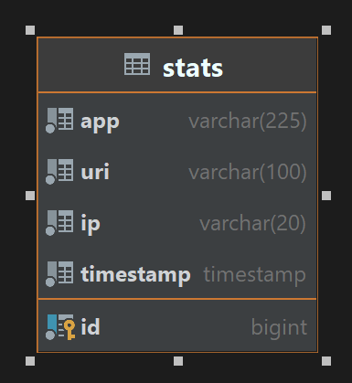

#### [Ссылка на пул-реквест](https://github.com/Wirt150/java-explore-with-me/pull/3)

# Дипломый проект курса Яндекс.Практикума (Java-developer) 
## *java-explore-with-me*

**Выполненные задачи в ходе дипломного проекта проекта:**

Веб-сервис для обработки потсупающей информации.
========================
#### [Ссылка API swagger-ui документации и доступных эндпоинтов (emw-service)](http://localhost:8080/swagger-ui/index.html)
Эта ссылка будет работать при запущенном приложении.

Сервер учета статистики обращений к энпоинтам веб-сервиса.
========================
#### [Ссылка API swagger-ui документации и доступных эндпоинтов (stat-service)](http://localhost:9090/swagger-ui/index.html)
Эта ссылка будет работать при запущенном приложении.

## Быстрый старт
### Требования
- Java Platform (JDK) 11
- Apache Maven 4.x

Находясь в каталоге в командной строке, введите:

`./mvn package`

`java -jar ewm-service/target/ewm-service-0.0.1-SNAPSHOT.jar`

`java -jar stats-server/target/stats-server-0.0.1-SNAPSHOT.jar`

## Быстрый старт Docker
### Требования
- Java Platform (JDK) 11
- Apache Maven 4.x
- Docker client (Docker-compose)

Находясь в каталоге в командной строке, введите:

`./mvn package`

`docker-compose up`
